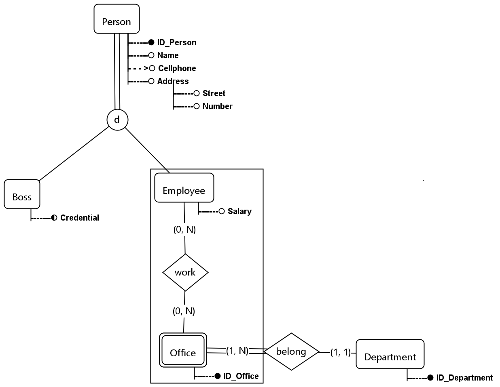
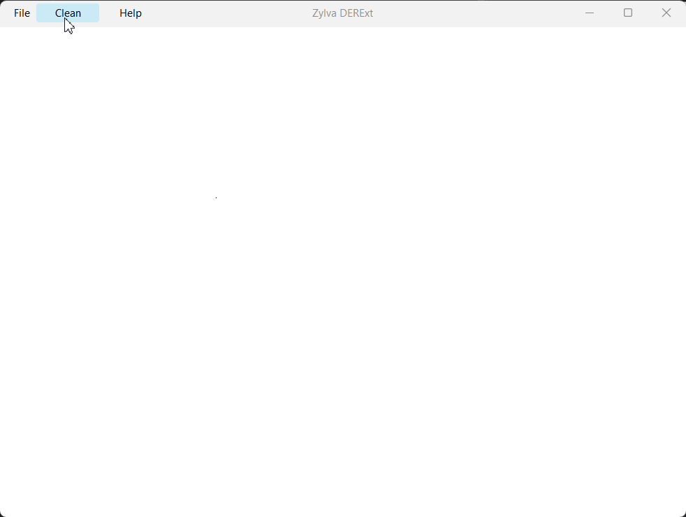
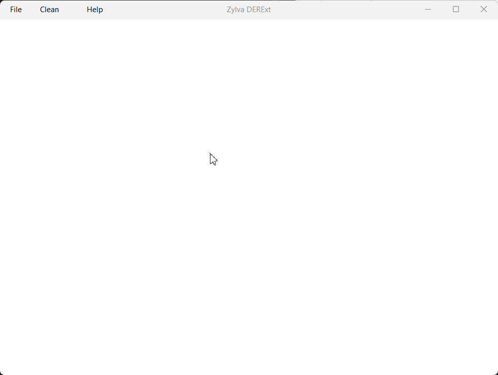

# Introduction

Zylva DERExt is an extended entity-relationship model diagram application developed in Java.

# PNG exportation and diagram save and load!

You can save and load your diagrams, as well as exporting them as PNG images.

# Easy and fast controls!

# Use it as you prefer!

The application is compatible with both mouse and keyboard shortcuts!

# Languages

The language of the application can be changed in any moment!

Right now, the application is only available in English and Spanish.

# Installation

Make sure you have downloaded Java Runtime Environment and JDK >= 23. Here are the links:
- https://www.java.com/es/
- https://www.oracle.com/java/technologies/downloads/

Once the previous programs are installed, you just need to execute the *.exe* file in *releases* (Windows) or execute
the *jar* file. The command for this is: java -jar *directory*/ZylvaDERExt.jar.

# What's next?

After the 1.0 version, which will bring optimization and improvements in the performance, my plan is:

- Improving the code's efficiency at the same time I acquire more knowledge about Java and algorithms.
- Adding more personalization tools.
- Adding the possibility to have various *tabs* open at the same time.
- Adding performance configurations for old computers.
- Adding the possibility of using a command-line interface.
- More languages!
- Expanding the app to more types of diagrams!

# About the author

My name is Iñaki. I'm a student of System Engineering. This is my first Java project.

During my career, in the *Databases I* subject, I worked with an over-complicated and not too well-working software
made in 2016 by other students of the career. Crashes and low performance motivated me to create an application which
could accomplish that purpose in a better way.