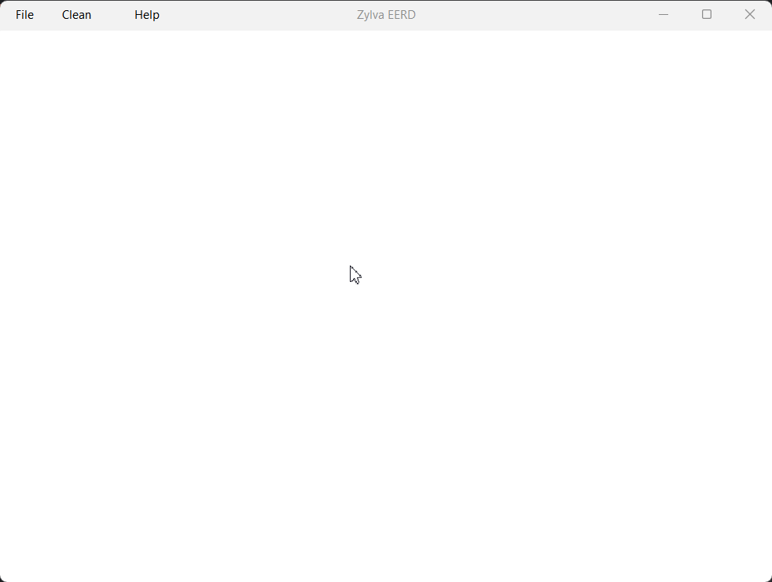

# Introduction

Zylva DERExt is an extended entity-relationship model diagrams application developed in Java.

# PNG exportation and diagram save and load!

# Easy and fast controls!

# Compatible with both mouse and keyboard commands!

Use it as you prefer. The application counts with both mouse and keyboard controls!

# Languages

The language of the application can be changed in any moment!

Right now, the application is only available in English and Spanish.

# About the author

My name is Iñaki. I'm a student of System Engineering. This is my first Java project.

During my career, in the Database I subject, I worked with an over-complicated and not too well-working software
made in 2016 by other students of the career. That's the reason why I decided to create an improved version of that
application.