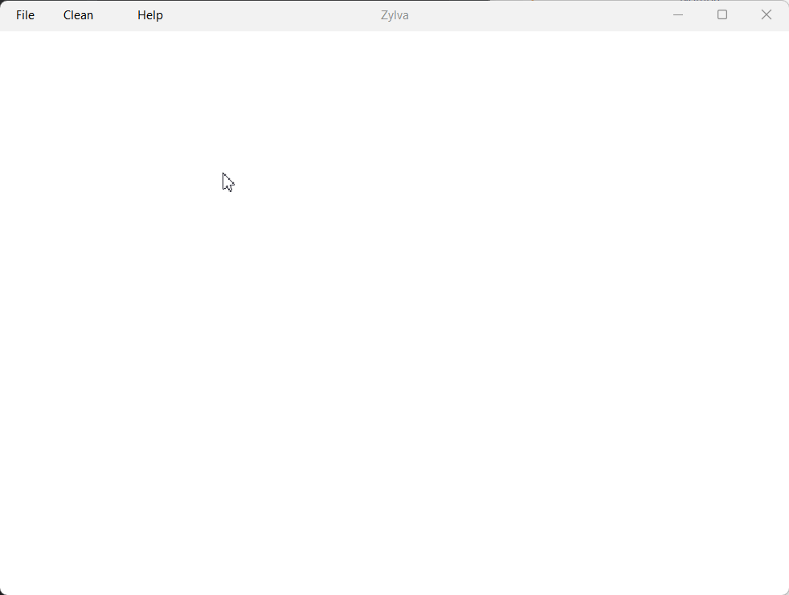
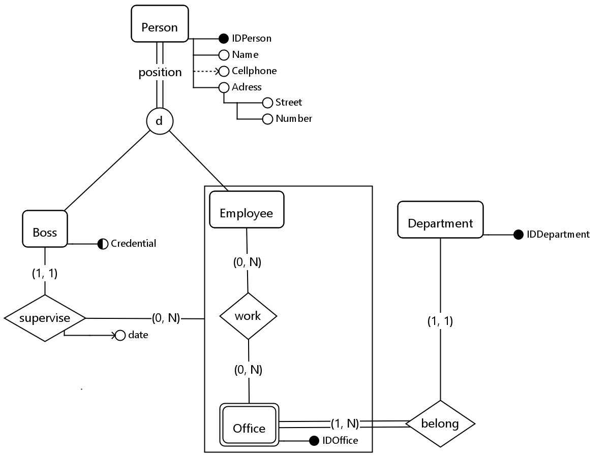
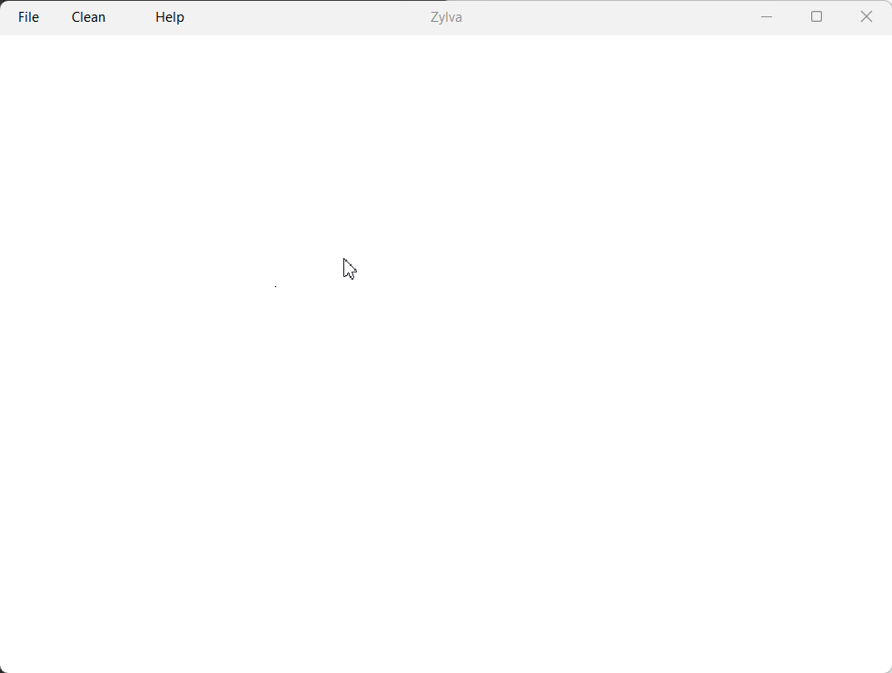

# Introduction.

Zylva is an enhanced entity-relationship (EER) model diagram and derivation application developed completely in Java.

> [!CAUTION]
>
> The application has only been tested by me, its author.
> It may contain severe bugs I haven't identified yet.
> Suggestions and contributions to possible improvements are highly appreciated.

# Easy and fast controls!



# Exportation!

You can save and load your diagrams, as well as exporting them as PNG images.



# Use it as you prefer!

Most of the application commands are compatible with both mouse and keyboard shortcuts!



# Derivation!

Derivate your diagrams automatically and get the result in an HTML format!


# Languages.

The language of the application can be changed at any moment!


# Installation.

Make sure you have downloaded Java Runtime Environment >= 8 Build 441 and JDK >= 23. Here are the links:
- https://www.java.com/en/download/manual.jsp
- https://www.oracle.com/java/technologies/downloads/

Once the previous programs are installed, you need to download and execute the *.jar* file
you can find in the latest release in the [Releases](https://github.com/iroumec/Zylva-EERD/releases) section.
Once downloaded, you can execute it by double-clicking on it or via command-line,
writing the next command and replacing the ellipsis with the path of the file.

```
java -jar .../ZylvaEERD.jar
```

> [!IMPORTANT]
> 
> In case you find yourself facing this error:
> 
>
> 
> It occurs due to an old version of Java or JDK being installed in your device.
> To fix it, completely uninstall all Java and JDK versions,
> install the new versions linked above and execute it again.

# What's next?

- Undo/Redo.
- Normalization.
- More languages.
- Complete the documentation.
- Adding more personalization tools.
- Provide all possible derivations of a diagram.
- Expanding the app to more types of diagrams.
- Optimization and improvements in the performance.
- Adding the possibility of using a command-line interface.
- Adding the possibility of having various *tabs* open at the same time.

# What motivated me to do this?

This is my first Java project. During my career, in the *Databases I* subject, I worked with an overcomplicated and
not too well-worked software made in 2016 by other students of the career. Crashes and low performance motivated me to
create an application which could achieve that purpose in a better way.
